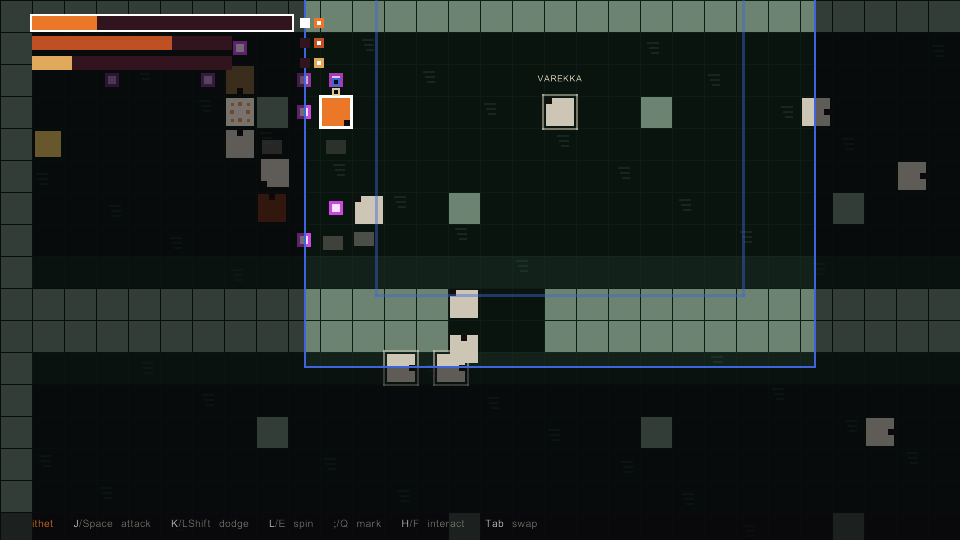

# game-two

A grid ARPG in Ruby + Gosu where you play the MONSTERS: an unbound echo
serving the court of Suvareth, possessing a pack of three vat-grown
bodies (Tab swaps), hunting looters through an interdicted funerary
quarter — bank the toll-scrapings, inscribe a body against the
judgment, pay the seals, and survive Varekka, the one man who chants
back.

- **Play:** `bin\play.cmd` (Windows) or `bin/play` — add `es` / `pt-br`
  for Spanish/Portuguese. Always quit with Esc (it saves telemetry).
- **Setup:** Ruby 3.4 **with DevKit** (gosu compiles from source), then
  `bundle install`. Portuguese onboarding: [docs/JUNIOR.md](docs/JUNIOR.md).
- **The sim is 100% deterministic** — replays reproduce tick-for-tick;
  every visual ships through a double-replay md5 gate + a vision critic
  ("the wall"). Current cycle + laws: [AGENTS.md](AGENTS.md); history:
  [docs/CHECKPOINT.md](docs/CHECKPOINT.md).
- **Tests:** `bundle exec rake` (git hooks run it on every commit/push).
