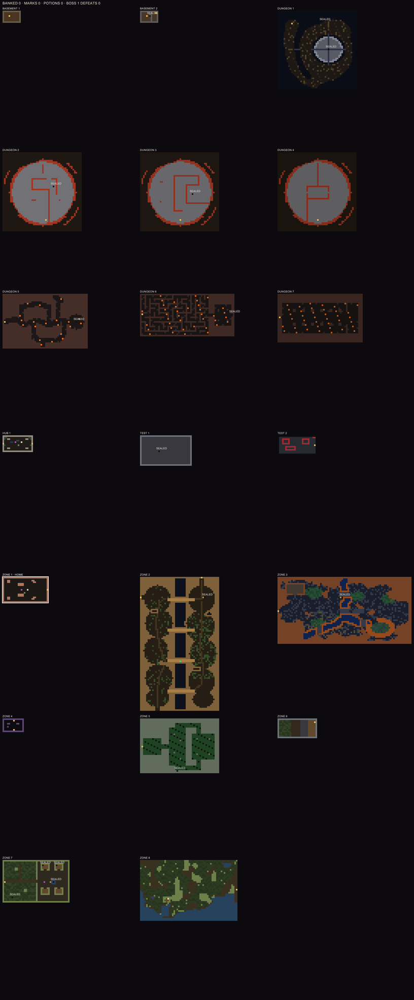

# game-two

A grid ARPG in Ruby + Gosu where you play a pack of three bodies
(Tab swaps): hunt enemies through connected zones, bank the value you
collect, pay tolls to open gates, and descend — five dungeons deep, with
a unique boss at the bottom of each — into a living underground.

**v21 MUNDO VIVO (2026-09-05):** sprites with idle/walk/windup/hit
animation (art is a replaceable atlas), living maps (water shimmer,
bubbles, torches, sparks, spores, fog — all tick-driven), tiles with
relief, six new enemy behaviors (fan of shots, petrify, blink, charge,
beam, poison, aura), phased bosses, and the world graph: the DESCENT
(ZONE 2 → 3 → 5 with BOSS 1 in the moss vault), the MEDUSA TOWER
(DUNGEON 1 → 4, forced loops, BOSS 2 at the bottom) and BRASA (DUNGEON
5 → 7, lava, BOSS 4 on the forge dais). Level cap 21.

All player-visible names are deliberate placeholders (ZONE 1, HUB 1,
BOSS 1, player 1…): this repo carries mechanics and engine only — no
lore, no creative writing (owner order, 2026-08-16).

- **Play:** `bin\play.cmd` (Windows) or `bin/play` — add `es` / `pt-br`
  for Spanish/Portuguese. Always quit with Esc (it saves telemetry).
- **Co-op:** host with `bin\host-coop.cmd`; join with `bin\join-coop.cmd`
  after both machines join the same Tailscale network.
- **Setup:** Ruby 3.4.10 **with DevKit** (gosu compiles from source), then
  `bundle install`. Portuguese onboarding: [docs/JUNIOR.md](docs/JUNIOR.md).
- **The sim is 100% deterministic** — replays reproduce tick-for-tick;
  every visual ships through a double-replay md5 gate + a vision critic
  ("the wall"). Current cycle + laws: [AGENTS.md](AGENTS.md); history:
  [docs/CHECKPOINT.md](docs/CHECKPOINT.md).
- **Tests:** `bundle exec rake` (git hooks run it on every commit/push).
