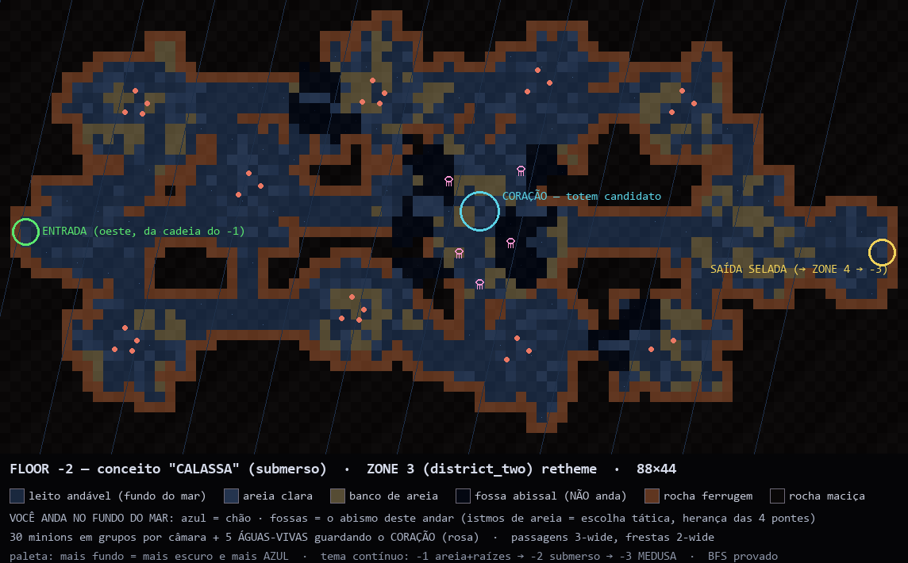
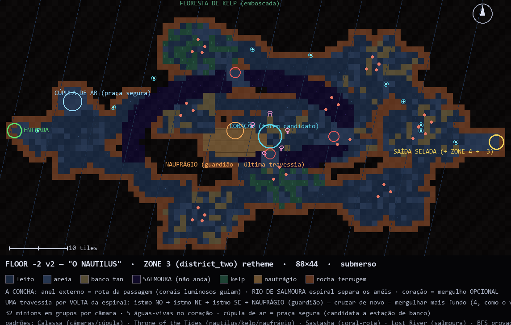
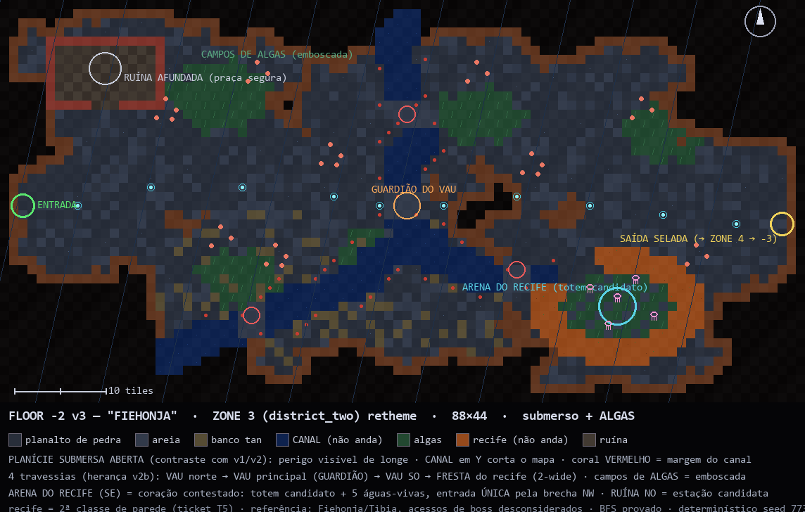

# Direções do Junior — FLOOR -2 (ZONE 3 / district_two), três conceitos aprovados (2026-08-29)

**GABRIEL: são TRÊS VERSÕES DO MESMO MAPA — a ZONE 3 (`district_two`),
o floor -2 da descida.** Não são três zonas novas: são três candidatos de
re-tematização para a dupla escolher — **um deles, ou pedaços de cada**
(mesmo processo do v2b da ZONE 2, lane D do v20). Todos os três estão
APROVADOS pelo Junior ("muito bom" nos três); a escolha final é tua/da
dupla.

## Contexto de tema (correção importante do Junior)

A descida é ENTRAR NO MAR: o -1 (ZONE 2, teu v2b shipped) é areia +
raízes na beira; **o -2 já é SUBMERSO — você anda NO fundo do mar**; o
-3 (ZONE 5) será o MEDUSA LOWER, o abismo das águas-vivas. As "medusas"
do conceito v3 dele sempre foram águas-vivas — o tema submerso amarra a
trilogia. Paleta segue a regra ratificada: mais fundo = mais escuro (e
mais azul).

Constantes nas três versões (estrutura do jogo):

- 88×44 (=v2b girado; ZONE 3 hoje é 44×26 — cresce no retheme).
- Fluxo oeste→leste: entrada oeste (da cadeia do -1), saída leste
  SELADA → ZONE 4 (slow_door) → floor -3 (endpoints preservados,
  mesma lei do T1).
- Passagens 3-wide (achado do v1 do Junior) · frestas 2-wide arriscadas.
- 4 travessias do intransponível — herança direta das 4 pontes do v2b.
- ~30 minions em grupos de arena + 5 águas-vivas guardando o coração ·
  coração = candidato a totem (lane C decide DEPOIS do piloto do -1).
- BFS provado no gerador (entrada→saída e entrada→coração) ·
  determinístico (seed no .py) · tiles do engine existentes, exceto
  onde marcado.

## v1 — "CALASSA" (câmaras submersas)

- Referência: Calassa (Tibia) — minimapa fornecido pelo Junior.
- 13 câmaras orgânicas cavadas na rocha, ligadas por passagens; rocha
  ferrugem no rim, rocha maciça fora. FOSSAS ABISSAIS (quase-preto)
  cortam as câmaras — istmos de areia = a escolha tática.
- CORAÇÃO central com águas-vivas; bancos de areia tan espalhados.
- Leitura: "dungeon de câmaras" — a mais próxima do v2b em sensação.
- Engine novo: NENHUM.
- md5 `d8eb2a823cd0a2f2e3caef804a26e876` · gen: `_refs/junior-floor2-v1-calassa-gen.py`

## v2 — "O NAUTILUS" (espiral + rio de salmoura)

- Pesquisa de padrões (não cópia): Calassa (cúpula de ar) · WoW/Throne
  of the Tides (concha-espiral, kelp, naufrágio) · FFXIV/Sastasha
  (coral luminoso = rota) · Subnautica/Lost River (rio de salmoura) ·
  Zelda/Water Temple (marco central orbitado).
- A caverna É uma concha: anel externo = rota da passagem; RIO DE
  SALMOURA (roxo-abissal, não anda) espirala pra dentro; **cada
  travessia = uma volta mais fundo** — istmo NO → istmo NE → istmo SE
  → NAUFRÁGIO (guardião) = última travessia pro CORAÇÃO no centro.
- Floresta de KELP (emboscada) · CÚPULA DE AR = praça segura,
  candidata a estação de banco · coração 100% opcional (risco/recompensa).
- Leitura: "o marco memorável" — a mais autoral das três.
- Engine novo: NENHUM (kelp = variante de grama; casco = madeira).
- md5 `c860182d3bd021ca991416a9da0c516b` · gen: `_refs/junior-floor2-v2-nautilus-gen.py`

## v3 — "FIEHONJA" (planície aberta + canal)

- Referência: Fiehonja (Tibia) — print fornecido pelo Junior (acessos
  de boss da foto desconsiderados por ordem dele). Tema: fundo do mar
  + ALGAS.
- PLANÍCIE SUBMERSA ABERTA (contraste deliberado com v1/v2: perigo
  visível de longe, sem câmaras) · CANAL profundo em Y corta o mapa,
  coral VERMELHO nas margens (a assinatura da referência) · 4 vaus
  (o principal com GUARDIÃO; o do recife é fresta 2-wide).
- ARENA DO RECIFE (SE): anel de coral laranja com lagoa de algas,
  entrada ÚNICA pela brecha NW — coração contestado. RUÍNA AFUNDADA
  (NO): alvenaria vermelha + piso xadrez, praça segura / estação
  candidata. 5 campos de algas de emboscada.
- Leitura: "a mais fiel à referência nova" — e a mais diferente do v2b.
- **Engine novo: precisa do T5 (2ª classe de parede)** — recife
  laranja + rim escuro coexistindo; mesmo ask que o MEDUSA LOWER do
  -3 já fez. T5 é first-wave: este mapa REFORÇA o caso dele.
- md5 `9e3d6da20e41801dd0b507fad37f6bb3` · gen: `_refs/junior-floor2-v3-fiehonja-gen.py`

## Quadro comparativo

| | v1 CALASSA | v2 NAUTILUS | v3 FIEHONJA |
|---|---|---|---|
| Leitura espacial | câmaras fechadas | espiral concêntrica | planície aberta |
| Intransponível | fossas abissais | rio de salmoura espiral | canal em Y |
| Coração | câmara central | centro da espiral (opcional) | arena do recife (entrada única) |
| Praça segura | — | cúpula de ar | ruína afundada |
| Marco narrativo | — | naufrágio-travessia | ruína + recife |
| Engine novo | nenhum | nenhum | **T5 (2ª parede)** |
| Parentesco | v2b (irmão direto) | autoral | referência nova do Junior |

## Estado técnico

- Sandbox do Junior: `C:/Users/jr/Desktop/mapas-game-two/` (geradores
  determinísticos .py + PNGs; iterar = mudar parâmetro e re-rodar).
  Cópias banked neste repo em `drafts/_refs/junior-floor2-*` (PNG +
  gen .py, digests acima).
- Nenhum toque em `data/` ou `authoring/` — conceitos apenas; a
  transcrição LDtk acontece no ticket da lane D (segunda wave, corta
  no fechamento de T4/T5), sob as leis de sempre (importer door,
  provenance, gate, canary, soak).
- Decisão pendente que este doc alimenta: qual direção (ou mistura)
  vira o floor -2 no ticket. A escolha é da dupla — Junior aprovou as
  três e fica feliz com qualquer uma.
