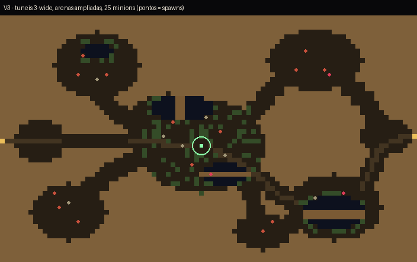
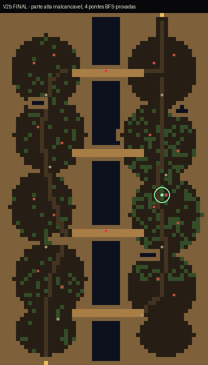
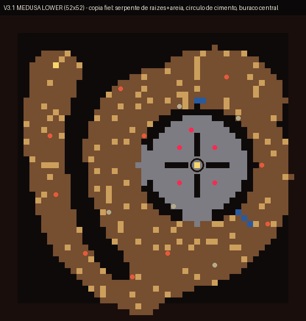

# Direção de mapas do Junior — ZONE 2, três conceitos aprovados (2026-08-28)

Papel da map-lane (`docs/MAP_EDITING.md`): Junior DIRIGE, o hub executa.
Este doc é o **direction intake** formal — zona, imagens de referência e
intenção. Entrega executa **pós-veredito** (freeze do ritual: mecânico,
como sempre).

## O essencial

**Os três conceitos abaixo são a MESMA zona — ZONE 2 (`district`) — em
três versões alternativas de re-tematização.** Não são três zonas novas:
são três candidatos de como a ZONE 2 pode ficar, para o Gabriel ver e a
dupla escolher (um deles, ou pedaços de cada).

Todos nasceram do fluxo aprovado da proposta forest-first do Junior
(a descida de 3 andares; ZONE 2 = 1º andar) e foram **testados jogáveis**
pelo Junior numa sandbox fora do repo (cópia isolada; o repo nunca foi
tocado). Cada um passou por prova mecânica de conectividade (BFS
entrada→saída, spawns alcançáveis) antes do teste humano.

## v1 — "Caverna de câmaras" (88×52)

- Inspiração: Czepeku "Secret Cave Hideout" (linguagem de cavernas
  orgânicas), fluxo oeste→leste do district atual preservado.
- 8 câmaras-arena ligadas por túneis LARGOS (3 tiles — iterado em teste:
  1 tile ficou claustrofóbico no viewport real), 4 fossos d'água com
  passarelas, 25 minions em grupos por arena, totem de cura conceitual
  no centro (candidato 3 do slate).
- Veredito do Junior em jogo: **aprovado** ("gostei").
- md5: `3e7af4e3f17c9f11cde9a443733390c0`

## v2b — "Dois espaços + 4 pontes" (52×88, retrato)

- Ideia do Junior: DOIS grandes espaços (oeste seco/escuro de
  acampamentos; leste vivo/musgoso com a clareira) separados por um
  ABISMO central intransponível (parte ALTA — cercada por rocha em todo
  o mapa, iterado em teste), cruzado por exatamente **4 pontes**.
- Fluxo diagonal: entra no sul-oeste, sai no norte-leste — escolher a
  ponte é a decisão tática (pontes-chave têm guardiões).
- 27 minions. Veredito do Junior em jogo: **aprovado** ("ficou bom").
- md5: `0ba972e094bf4ed065a1470e618dd03f`

## v3 — "MEDUSA LOWER" (52×52)

- Inspiração: Medusa Tower (Tibia), **invertida para baixo** — nome de
  trabalho MEDUSA LOWER (placeholder no jogo continua ZONE 2).
- Cópia fiel da referência que o Junior forneceu: a SERPENTE de raízes
  marrons com areia (esquerda, entrada na cabeça), o CÍRCULO de cimento
  com muralha + cruz interna (direita), e o **buraco central** = a
  descida (transição `hole` real, auto-dispara — andar -2 no conceito).
- 5 "medusas" (rusher_haters) guardando o miolo; 20 minions.
- Iterações de teste: paredes-limite escurecidas até quase-preto a
  pedido do Junior. **Limitação encontrada e registrada:** a paleta tem
  UMA cor de parede por zona — a muralha vermelha da referência e as
  bordas pretas não podem coexistir hoje. Candidato de ask v20: segunda
  classe de parede no registro de tiles (o D7 já previu hooks).
- Veredito do Junior em jogo: **aprovado** ("gostei").
- md5: `124155a71359c8b23c37c0dbbe183e3b`

## Estado técnico (para a execução pós-veredito)

- Os três existem também como **zone-JSON jogáveis** (formato canônico,
  spawns + transições validados pelo engine real) na máquina do Junior
  (`Desktop/game-two-conceitos/*.json`) — a transcrição pós-veredito
  parte de geometria funcionando, não de papel.
- Nenhum toque no repo além destes drafts; sandbox descartável; save
  compartilhado intocado.
